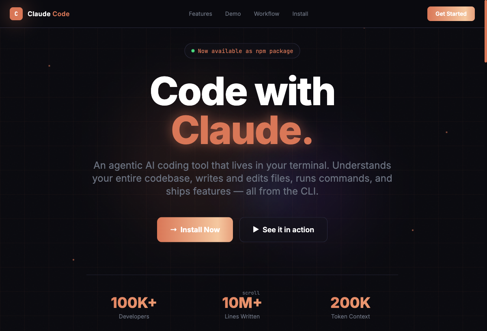
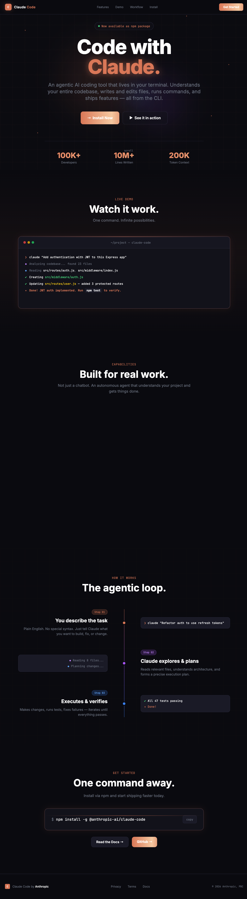

![[screenshots/landing-page-hero.png]]

# Hands-on Claude Code

A collection of projects built while learning [Claude Code](https://claude.ai/code) — Anthropic's agentic AI coding tool for the terminal.

## Projects

### 01 — Claude Code Landing Page

**File:** `index.html`

A dark-themed, animated landing page for Claude Code built with pure HTML and Tailwind CSS (CDN). No build step required.

**Features:**

- Dark theme with a custom `#0A0A0F` background and Claude's signature orange (`#D97757`)
- Grid background, noise overlay, and floating particle effects
- Animated terminal demo with staggered line reveal
- Scroll-triggered feature card animations via Intersection Observer
- Shimmer button effect using CSS `background-size` animation
- Scan-line effect on terminal / install boxes
- Step-by-step workflow section with a connected timeline
- Copy-to-clipboard install command with feedback
- Sticky nav with backdrop blur
- Fully responsive (mobile → desktop)

**Screenshot:**





**Open locally:**

```bash
open index.html
# or
python3 -m http.server 8000
```

---

## About This Repo

This repo documents a hands-on learning journey with Claude Code. Each folder / file is a small experiment or project created during the session — from simple UI pages to more complex integrations.

**Stack used so far:**

- HTML + Tailwind CSS (CDN)

---

## The `.claude/` Directory

The `.claude/` directory is the configuration layer for Claude Code in this repo. It controls how Claude Code behaves, what rules it follows, and what tools it has access to during a session.

```
.claude/
├── CLAUDE.md               # Root instructions loaded into every session
├── settings.json           # Hook registrations (which scripts run on which events)
├── settings.local.json     # Local overrides (not committed)
├── rules/                  # Granular rule files injected as context
│   ├── animations.md       # Animation principles and patterns
│   ├── code-quality.md     # HTML, CSS, JS, and accessibility standards
│   ├── git-workflow.md     # Commit conventions and safety rules
│   ├── project-structure.md# File naming, layout, and what not to add
│   └── ui-design.md        # Color palette, typography, and layout tokens
├── hooks/                  # Python scripts that run on Claude Code lifecycle events
│   ├── pre-bash.py         # Blocks dangerous shell commands before execution
│   ├── post-edit.py        # Logs every file Claude edits to logs/edits.log
│   ├── on-stop.py          # Logs session end + sends a desktop notification
│   └── on-notification.py  # Sends an OS notification when Claude needs attention
├── commands/               # Custom slash commands (/commit, /review, /new-experiment)
│   ├── commit.md           # Guides a clean git commit following project rules
│   ├── review.md           # Audits a file against all rule categories
│   └── new-experiment.md   # Scaffolds a new experiment with standard boilerplate
├── agents/                 # Specialized subagents with scoped tools and instructions
│   ├── ui-builder.md       # Builds dark-themed HTML experiments
│   ├── code-reviewer.md    # Audits code against project rules
│   └── readme-updater.md   # Keeps README.md in sync after new experiments
└── logs/                   # Auto-generated log files (gitignored content)
    ├── edits.log           # Timestamped log of every file Claude edited
    └── sessions.log        # Timestamped log of session completions
```

### CLAUDE.md

The root instruction file — loaded automatically at the start of every Claude Code session. It defines the project's purpose, conventions, coding preferences, and behavioral rules (like "never auto-commit").

### rules/

Fine-grained rule files that Claude Code consults when writing or reviewing code:

| File                   | Purpose                                                                                                                 |
| ---------------------- | ----------------------------------------------------------------------------------------------------------------------- |
| `animations.md`        | Defines animation patterns (entrance, float, shimmer, glow), easing defaults, and `prefers-reduced-motion` requirements |
| `code-quality.md`      | Covers semantic HTML, Tailwind-first CSS, vanilla JS conventions, accessibility, and performance                        |
| `git-workflow.md`      | Enforces Conventional Commits format, forbids auto-push, and specifies safe staging practices                           |
| `project-structure.md` | Defines file naming (kebab-case), folder layout, and what not to commit                                                 |
| `ui-design.md`         | Establishes the design system: color tokens, typography scale, layout widths, and component patterns                    |

### hooks/

Python scripts wired to Claude Code lifecycle events via `settings.json`:

| Hook                 | Trigger                           | What it does                                                                               |
| -------------------- | --------------------------------- | ------------------------------------------------------------------------------------------ |
| `pre-bash.py`        | Before every Bash command         | Scans for dangerous patterns (`rm -rf /`, `dd if=/dev/zero`, etc.) and blocks them         |
| `post-edit.py`       | After Write / Edit / NotebookEdit | Appends a timestamped entry to `logs/edits.log` with the tool name and file path           |
| `on-stop.py`         | When Claude finishes a task       | Logs the session completion and fires an OS desktop notification (macOS / Linux / Windows) |
| `on-notification.py` | When Claude needs user attention  | Sends an urgent OS notification with the message content                                   |

### commands/

Custom slash commands available in Claude Code sessions via `/command-name`:

| Command           | What it does                                                                                                                                |
| ----------------- | ------------------------------------------------------------------------------------------------------------------------------------------- |
| `/commit`         | Walks through `git status` → `git diff` → staged review → proposes a Conventional Commits message → asks for confirmation before committing |
| `/review`         | Audits a file against all rule categories (HTML, CSS, JS, animations, accessibility, structure) and outputs a structured pass/fail report   |
| `/new-experiment` | Asks for a description, derives a kebab-case filename, scaffolds a standard boilerplate HTML file, and reminds you to update README.md      |

### agents/

Specialized subagents with scoped system prompts and tool access. Invoked automatically by Claude Code when the task matches:

| Agent            | When used                                        | Tools available               |
| ---------------- | ------------------------------------------------ | ----------------------------- |
| `ui-builder`     | Creating new UI components, pages, or animations | Read, Write, Edit, Glob, Bash |
| `code-reviewer`  | Thorough audit of a file before committing       | Read, Glob, Grep, Bash        |
| `readme-updater` | Keeping README.md in sync after a new experiment | Read, Edit, Glob, Bash        |

### logs/

Auto-generated by hooks. Not committed (the directory is tracked via `.gitkeep`, but log contents are local).

- `edits.log` — every file Claude touched, with timestamp and tool name
- `sessions.log` — every session completion timestamp

---

## Learning Resources

- [Claude Code Docs](https://docs.anthropic.com/claude-code)
- [Anthropic API Docs](https://docs.anthropic.com)
- [Claude Code GitHub](https://github.com/anthropics/claude-code)
